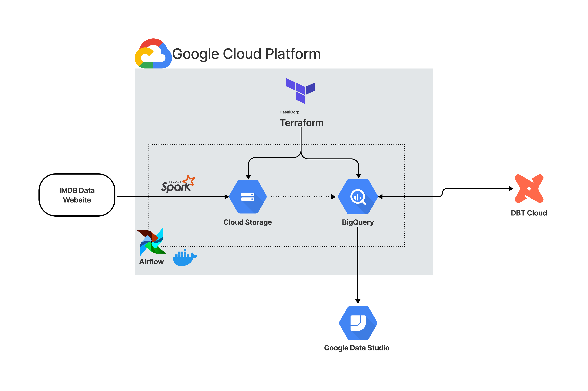
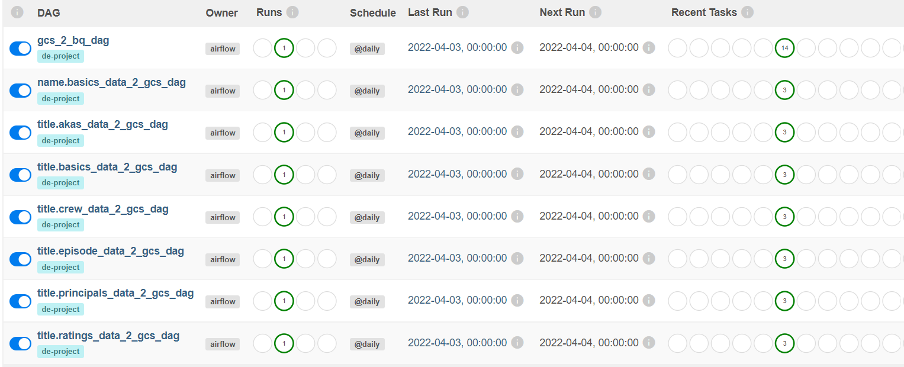
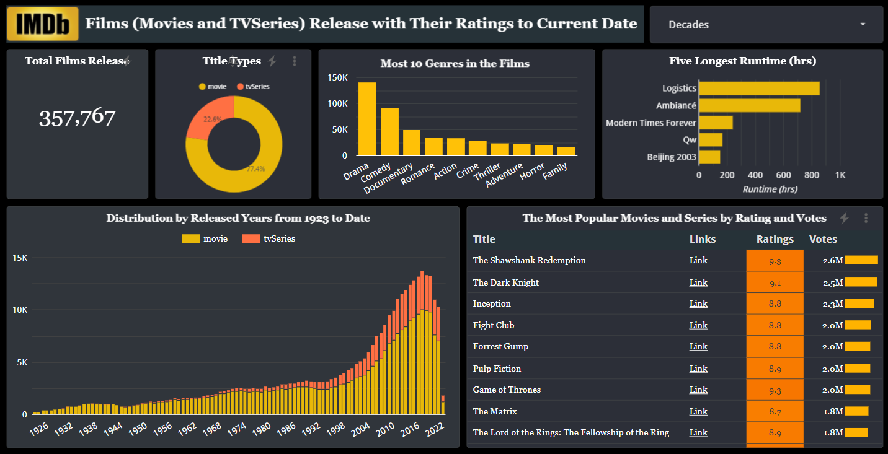

# Project Proposal

## Problem description - IMDB Movies and Series Rating
IMDB is a popular online and authorative source for movies and TV shows review and ratings and has database of infomation related to films, TV series and streaming content online including cast and production crew.

Lovers of films and reviewer will like the know the most popular movies of all time and their total reviews, distribution of films by year of release from 1923 till date, the top rated movies in the current year.

For this solution to be possible, the data engineer and analytic will need to create data pipeline to extract the raw data from the IMDB online database to datalake (GCS) which will be transform, structure and storage in Data Warehouse (Bigquery). Thereafter populated into actionable dashboard.

Although the data is updated daily on the IMDB database, the pipeline will be set to refresh weekly and henceforth updating the dashboard.

## Dataset
The data is a subset of IMDB dataset which is available for access on the [IMDB Datasets](https://datasets.imdbws.com/) which is been refreshed daily. Each dataset is contained in a gzipped, tab-separated-values (TSV) formatted file in the UTF-8 character set.

## Data Pipeline



## Technologies
1. Cloud: GCP
2. Infrastructure as code (IaC): Terraform
3. Datalake: GCP Bucket
4. Workflow orchestration: Airflow 
5. Data Warehouse: BigQuery 
6. Transformations: dbt
7. Dashboard with Data Studio

### Cloud: GCP
The Google Cloud Platform is used for deploying the pipeline, Google Cloud Storage (GCS) as a data lake, and BigQuery as a data warehouse.

### Infrastructure as code (IaC): Terraform
Terraform is an open source tool which has been used for provisioning infrastructure resources. In this case, it was used to create GCP Infra by creating the following [Terraform files](./terraform):
- `main.tf`
- `variables.tf`
- `.tfstate`

The necessary configurations were made to ensure the successful execution and also set the resources as `google_storage_bucket, google_bigquery_dataset, google_bigquery_table` thereby creating the bucket from the project and also creating the BigQuery dataset and the bigquery tables for all movie data and the transform data from DBT.

#### Execution steps
1. `terraform init`:
    * Initializes & configures the backend, installs plugins/providers, & checks out an existing configuration from a version control
2. `terraform plan`:
    * Matches/previews local changes against a remote state, and proposes an Execution Plan.
3. `terraform apply`:
    * Asks for approval to the proposed plan, and applies changes to cloud.

### Workflow orchestration: Airflow
Apache Airflow is a platform to programmatically schedule and mointor workflows as DAGs. With Airflow, we have command line utilities as well as a user interface to visualise pipelines, monitor progress and troubleshoot issues.



### Transformation (dbt)
Transformation was done using [dbt](https://www.getdbt.com/).
The documentation of the data can be find [here](./analytics_engineering/models/staging/schema.yml) to understand the data and what the represent.

The `title basics` contains movies not yet release and `title ratings` are only movies and series that  have been released. To get the released movies and series, join the `title basics` and `title ratings`.


### Dashboard
The [dashboard](https://datastudio.google.com/s/kJWMinVHqMw) was built on Google Data Studio. Connecting the BigQuery data warehouse to Google Data Studio was very easy.


### Reproduce the Project
The steps to reproduce this pipeline is as follows:
1. Clone the repo
    ```
        git clone https://github.com/oseghalepatrick/data-eng-zoomcamp.git

        cd data-eng-zoomcamp/project/
    ```
2. Setup Terraform for IaC [here](https://github.com/DataTalksClub/data-engineering-zoomcamp/tree/main/week_1_basics_n_setup/1_terraform_gcp)<br>
Then run the scripts in the following order [here](./terraform/README.md)

3. Setup the Docker and Airflow [here](./data_ingestion/README.md)

4. To setup dbt follow the instruction [here](./analytics_engineering/README.md)